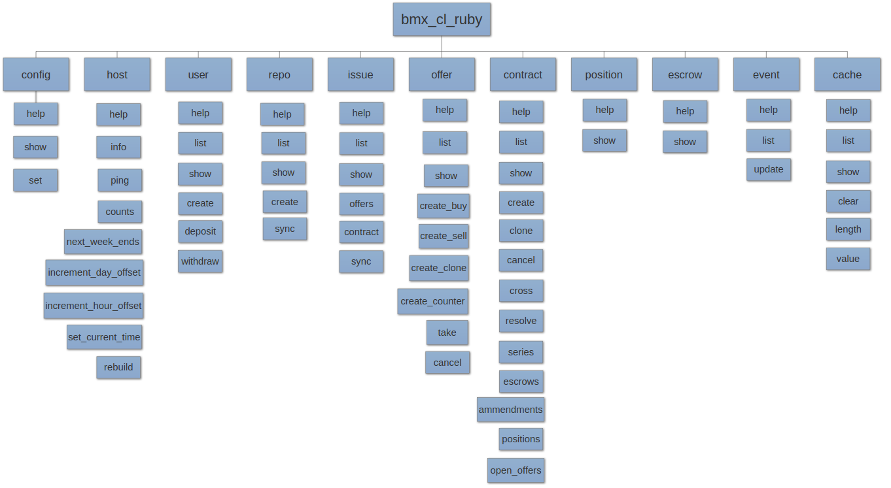

# bmx_cl_ruby
	|
	|--> config
    |  	   |--> help
    |  	   |--> show
    |  	   |--> set
	|--> host
    |  	   |--> help
    |  	   |--> info
    |  	   |--> ping
    |  	   |--> counts
    |  	   |--> next_week_ends
    |  	   |--> increment_day_offset
    |  	   |--> increment_hour_offset
    |  	   |--> set_current_time
    |  	   |--> rebuild
	|--> user
    |  	   |--> help
    |  	   |--> list
    |  	   |--> show
    |  	   |--> create
    |  	   |--> deposit
    |  	   |--> withdraw
	|--> repo
    |  	   |--> help
    |  	   |--> list
    |  	   |--> show
    |  	   |--> create
    |  	   |--> sync
	|--> issue
    |  	   |--> help
    |  	   |--> list
    |  	   |--> show
    |  	   |--> offers
    |  	   |--> contract
    |  	   |--> sync
	|--> offer
    |  	   |--> help
    |  	   |--> list
    |  	   |--> show
    |  	   |--> create_buy
    |  	   |--> create_sell
    |  	   |--> create_clone
    |  	   |--> create_counter
    |  	   |--> take
    |  	   |--> cancel
	|--> contract
    |  	   |--> help
    |  	   |--> list
    |  	   |--> show
    |  	   |--> create
    |  	   |--> clone
    |  	   |--> cancel
    |  	   |--> cross
    |  	   |--> resolve
    |  	   |--> series
    |  	   |--> escrows
    |  	   |--> ammendments
    |  	   |--> positions
    |  	   |--> open_offers
	|--> position
    |	   |--> help
    |	   |--> show
	|--> escrow
    |	   |--> help
    |	   |--> show
	|--> event
    |	   |--> help
    |	   |--> list
    |	   |--> update
	|--> cache
		   |--> help
		   |--> list
		   |--> show
		   |--> clear
		   |--> length
		   |--> value

### I have also added a image depicting the design of bash completion file
